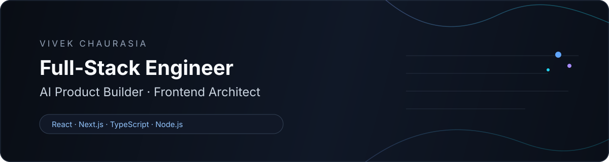

<p align="center">
  
</p>

<p align="center">
  <strong>Senior Full-Stack Engineer · AI Product Builder · Frontend Architect</strong>
</p>

<p align="center">
  Building scalable, high-performance digital products with
  <strong>React, Next.js, TypeScript & Node.js</strong> —
  with a strong focus on frontend architecture, product experience,
  performance, accessibility, and AI-powered applications.
</p>

<p align="center">
  <a href="https://vivekchaurasia.in">🌐 Portfolio</a>
  &nbsp; • &nbsp;
  <a href="https://www.linkedin.com/in/vivekch123/">💼 LinkedIn</a>
  &nbsp; • &nbsp;
  <a href="mailto:vivek.kch05@gmail.com">📩 Email</a>
</p>

<p align="center">
  
</p>

---

## 👨‍💻 About Me

I'm a **Senior Full-Stack Engineer with 7+ years of experience** building modern web applications, scalable frontend systems, and real-world digital products.

My strongest area is **frontend engineering and architecture** — particularly React, Next.js, TypeScript, reusable component systems, design systems, accessibility, and performance.

I also build products end-to-end, working across frontend applications, APIs, backend services, business logic, databases, authentication, integrations, and deployment.

Alongside engineering, I enjoy building **AI-powered products and agents**, experimenting with new ideas, and turning concepts into useful products.

I've worked across **enterprise applications, SaaS platforms, AI products, management systems, productivity tools, e-commerce experiences, hospitality platforms, and consumer-facing applications**.

---

# 💼 Professional Experience

### Associate Staff Engineer · Nagarro

Working on enterprise insurance platforms with a strong focus on frontend modernization, scalable UI engineering, accessibility, and performance.

- React.js / Next.js migration and modernization
- Enterprise frontend architecture
- User-facing registration and service workflows
- Redux / Recoil state management
- WCAG 2.1 AA accessibility
- CI/CD and cloud-based development workflows
- Collaboration across product, design, engineering, and delivery teams

**React · Next.js · Redux · Recoil · JavaScript · WCAG · AWS · Docker · Jenkins · CI/CD**

---

### SDE-II · Mobcoder

Worked across multiple client products and business domains, building responsive and scalable applications from real-world requirements.

- Drag-and-drop form builder
- B2B invoicing workflows
- Communication and chatbot experiences
- Reusable React components
- API-driven applications
- State management and frontend architecture

**React · Redux · GraphQL · Apollo Client · Styled Components · Ant Design · Material UI · Webpack**

---

### Software Engineer · GlobalLogic

Worked on a healthcare rostering platform focused on scheduling, staff allocation, planning workflows, and scalable user interfaces.

**React · Redux · TypeScript · Material UI · JavaScript**

---

# 🚀 Products I've Built

I enjoy taking ideas from:

**Concept → Architecture → Development → Deployment → Product**

### 🤖 Social Media AI Agent

An AI-powered social media automation product combining AI workflows, content generation, automation, integrations, and full-stack product infrastructure.

**Focus:** AI Agents · Automation · AI Workflows · Product Engineering · Full-Stack Development

---

### 🌐 Tractzo

A product ecosystem focused on building practical digital solutions and modern web experiences.

**Focus:** Product Engineering · Full-Stack Development · Frontend Architecture · Modern Web

🔗 [Visit Tractzo](https://tractzo.com)

---

### 🏠 Hostel Manager

A real-world hostel/property management platform designed to simplify operational workflows around rooms, residents, assignments, fees, and day-to-day management.

**Focus:** Management Systems · Dashboards · Workflow Automation · Full-Stack Development

🔗 [Open Hostel Manager](https://hostelmanager.tractzo.com)

---

### 📄 VibrantCV

A modern resume-building platform focused on helping users create professional, ATS-friendly resumes through an intuitive product experience.

**Focus:** Product UX · Resume Generation · Templates · Frontend Engineering

🔗 [Visit VibrantCV](https://vibrantcv.com)

---

### 💍 BiodataCraft

A specialized biodata creation platform combining customizable templates, document generation, and a privacy-conscious user experience.

**Focus:** Product Design · Document Generation · Templates · Full-Stack Development

🔗 [Visit BiodataCraft](https://biodatacraft.in)

---

### 🛍️ Antiqova

A premium commerce and product experience combining technology, branding, visual storytelling, and customer-focused digital experiences.

**Focus:** E-commerce · Product Experience · Premium UI · Full-Stack Product Engineering

---

### 📚 PadhoSpace

A learning-focused digital product built as part of my broader product-building and experimentation work.

**Focus:** Education · Product Engineering · Frontend Experience

---

# 💼 Selected Client Work

I've also worked on **client-driven digital products**, translating business requirements into production-ready web experiences.

### 🏠 Explore Hostel Life Jaisalmer

A client-driven hospitality experience focused on accommodation, destination information, and customer-facing interactions.

**Focus:** Frontend Development · UI Engineering · Responsive Design · Client Requirements

🔗 [Visit Website](https://www.explorehostelifejaisalmer.com/)

---

### 🏜️ Explore Overnight Desert Camp

A client-driven hospitality experience designed around desert-camp offerings, visual storytelling, and customer engagement.

**Focus:** Frontend Development · UI/UX · Responsive Experience · Client Requirements

🔗 [Visit Website](https://www.exploreovernightdesertcamp.com/)

---

# 🧪 Other Engineering Work

Beyond my primary products and client work, I experiment with different areas of software engineering:

- 🧩 Micro-frontend architectures
- 🎨 Reusable UI & design systems
- 📊 Data-driven dashboards
- 🤖 AI-powered applications
- 🔌 API-driven platforms
- 📁 Productivity & file-management tools
- 🧠 Learning & educational applications
- 🏢 Management & operational systems
- 🛒 E-commerce experiences
- ⚡ Performance-focused web applications

---

# 🧠 Core Expertise

<table>
<tr>
<td width="50%">

### ⚛️ Frontend Engineering

React.js · Next.js · TypeScript · JavaScript  
Redux · Recoil · GraphQL · REST APIs  
Reusable Components · Design Systems  
Responsive UI · Accessibility

</td>

<td width="50%">

### 🏗️ Frontend Architecture

Scalable UI Architecture  
Micro-frontends  
Component Architecture  
State Management  
API-driven Applications  
Enterprise Frontend Systems

</td>
</tr>

<tr>
<td width="50%">

### ⚙️ Full-Stack Engineering

Node.js  
REST APIs & Backend Services  
Authentication & Authorization  
Business Logic  
Database Integration  
Third-party Integrations

</td>

<td width="50%">

### ⚡ Performance & Quality

SSR & Hydration  
Code Splitting · Lazy Loading  
Rendering Optimization  
Web Performance  
WCAG 2.1 AA  
Jest · React Testing Library

</td>
</tr>
</table>

---

# 🤖 AI & Modern Development

I build AI-powered product experiences and use modern AI-assisted development workflows to move from idea to implementation faster.

**AI Agents · AI Workflows · Automation · LLM-powered Applications**

**AI-assisted development:** Cursor · GitHub Copilot · Claude · Antigravity

---

# 🛠️ Technology

### Frontend

<p>
  
</p>

### Backend

<p>
  
</p>

### Testing & Tooling

<p>
  
</p>

---

# 🧭 How I Approach Engineering

I believe great products sit at the intersection of:

<p align="center">
  <strong>Architecture × Performance × Product × User Experience</strong>
</p>

When I build a product, I think beyond individual features and consider the complete system:

```text
Product Idea
     ↓
User Experience
     ↓
Frontend Architecture
     ↓
APIs & Business Logic
     ↓
Data & Infrastructure
     ↓
Performance & Reliability
     ↓
A Product People Actually Want to Use
